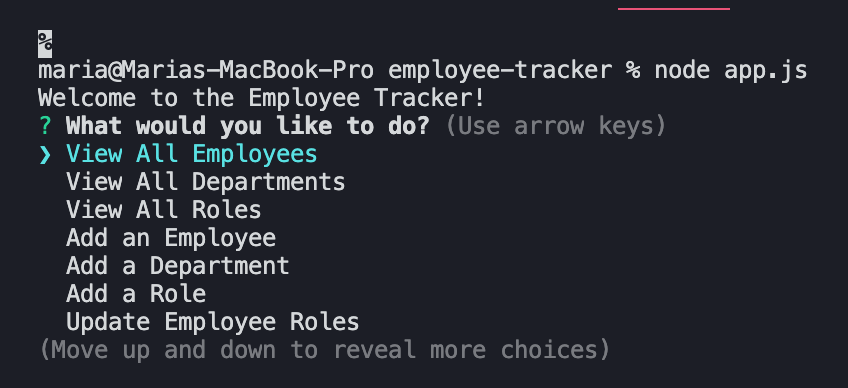
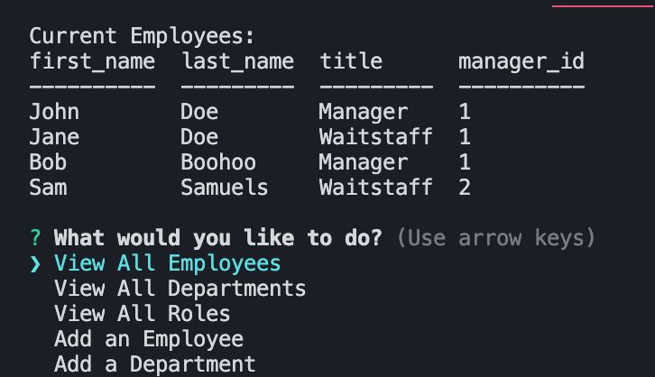
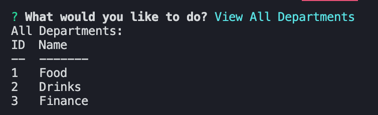
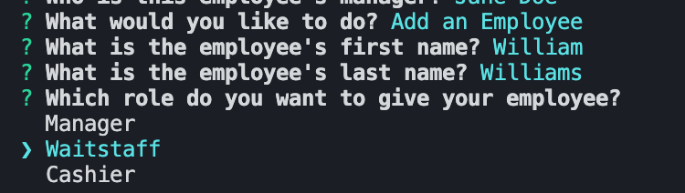
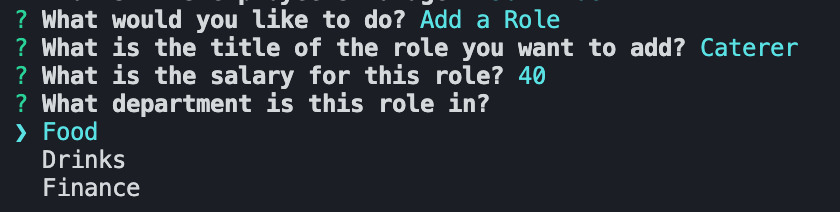
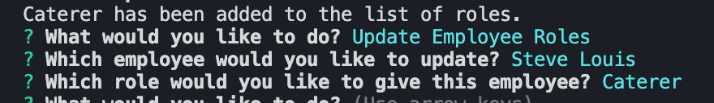

# Employee Tracker

> In a company with a great deal of employees, a business owner may seek to view all of the employees, roles, and departments they have, add new aspects to their company, or reassign certain employees' roles. Using Node.js, Inquirer, and MySQL, the Employee Tracker application allows users to input data about their companies and edit it at a record pace.

## Description

As a business owner, one may want to view and manage the different departments, roles, and employees within their company at a quick pace. Instead of trying to keep track of paperwork or endless Microsoft Excel files, the Employee Tracker application can be used to record employee names and positions, as well as different roles and departments within a company. This application uses Node.js (with the Node packages Inquirer.js, Console.table, and Util) as well as MySQL to allow employee data to be written, edited, and displayed in the console.

## Usage

When opening the Employee Tracker application, users are immediately greeted with prompts that they can choose from. If a user chooses "View All Employees", "View All Roles", or "View All Departments", they will be presented with a table displaying the respective aspect of the company they chose. If they choose "Add an Employee", they can input an employee's first and last name, choose the employee's role, and even assign a manager to the employee. When choosing "Add a Role", users can create a new role and set its salary and the department it is in. When choosing "Add a Department", users can create a new department that they can subsequently add roles and employees to. And when choosing "Update Employee Roles", they can select the employee whose role they want to update and assign them a new role. If users are all done using the Employee Tracker, they can select "Exit Program" from the list of prompts.

You can view a video guide on how to use the application [here](https://drive.google.com/file/d/1VCgsN4pI9A3a2aUWL2QOIzR1RyZy4Bhy/view?usp=sharing)!

## Screenshots

Introductory prompt list when first running the program

Display of employees

Display of departments

Adding a new employee to the program

Adding a new role to the program

Updating an employee's role

## Questions

If you have additional questions, you can contact me through my GitHub profile at [mwaslick](https://github.com/mwaslick), or e-mail me at mariawaslick@gmail.com.